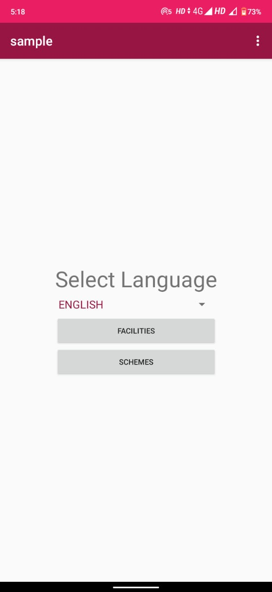
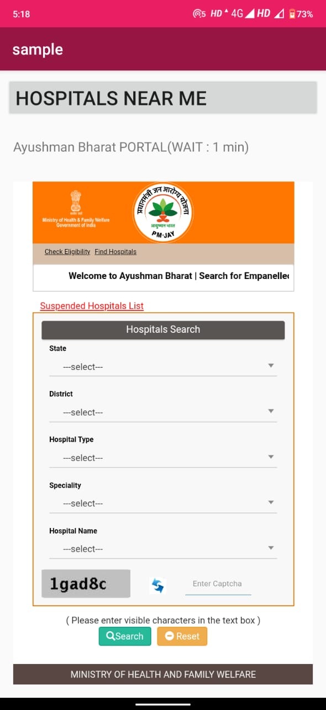
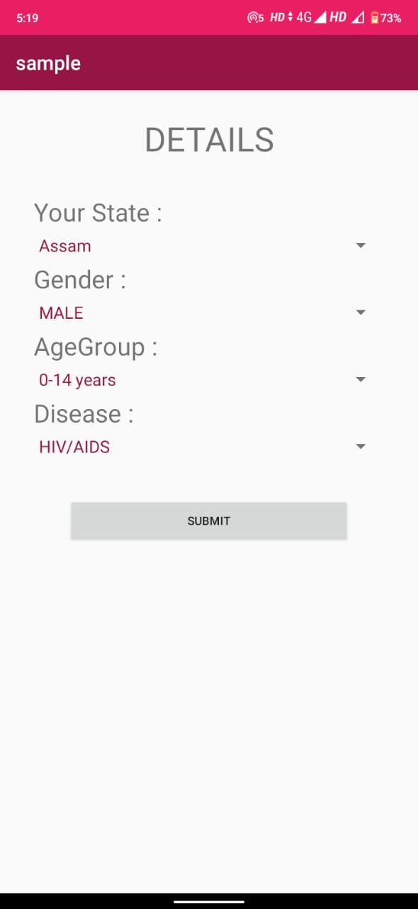

# EK_YOJNA

Let's take a situation
If a person just suddenly gets to know that he/she is suffering from a major illness this situation creates trauma in his mind and he rushes to the most advanced hospital in the country to get the treatment.

But it is not the same for people who earn the below-average income they have to struggle to get the right consultancy and treatment.

There are various health schemes funded by the government which is different for each state of INDIA and divided across more than 1000's of government websites
and are usually difficult to understand.

With keeping this in mind EKYOJNA was created.

Overall Layout
--------------
App contains a ListView which becomes populated with list items.

List Item Layout
-----------------
List Items display at least author and title information.

Layout Best Practices
---------------------

The code adheres to all of the following best practices:
- Text sizes are defined in sp
- Lengths are defined in dp
- Padding and margin is used appropriately, such that the views are not crammed up against each other.

Text Wrapping
--------------

Information displayed on list items is not crowded.

Rotation
--------

Upon device rotation:

- The layout remains scrollable.
- The app should save state and restore the list back to the previously scrolled position.
- The UI should adjust properly so that all contents of each list item is still visible and not truncated.
- The Search button should still remain visible on the screen after the device is rotated.

Runtime Errors
--------------

The code runs without errors.

API Call
---------

The user can enter a word or phrase to serve as a search query. The app fetches book data related to the query via an HTTP request from the Google Books API, using a class such as HttpUriRequest or HttpURLConnection.

Response Validation
------------------

The app checks whether the device is connected to the internet and responds appropriately. The result of the request is validated to account for a bad server response or lack of server response.

Async Task
------------------

The network call occurs off the UI thread using an AsyncTask or similar threading object.

JSON Parsing
------------

The JSON response is parsed correctly, and relevant information is stored in the app.

ListView Population
-------------------

The ListView is properly populated with the information parsed from the JSON response.

No Data Message
---------------

When there is no data to display, the app shows a default TextView that informs the user how to populate the list.

External Libraries and Packages
--------------------------------

The intent of this project is to give you practice writing raw Java code using the necessary classes provided by the Android framework; therefore, the use of external libraries for core functionality will not be permitted to complete this project.

#Code Readability
-----------------

Naming conventions
------------------

All variables, methods, and resource IDs are descriptively named such that another developer reading the code can easily understand their function.

Format
------

The code is properly formatted i.e. there are no unnecessary blank lines; there are no unused variables or methods; there is no commented out code.
The code also has proper indentation when defining variables and methods.

